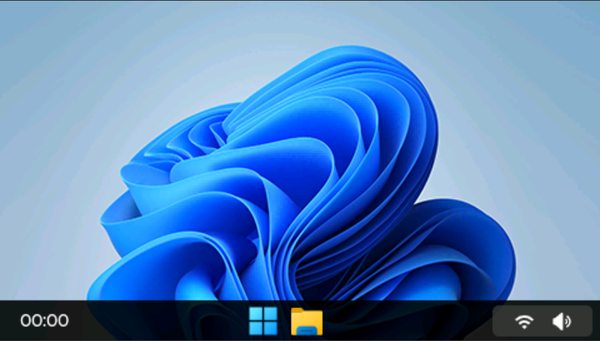
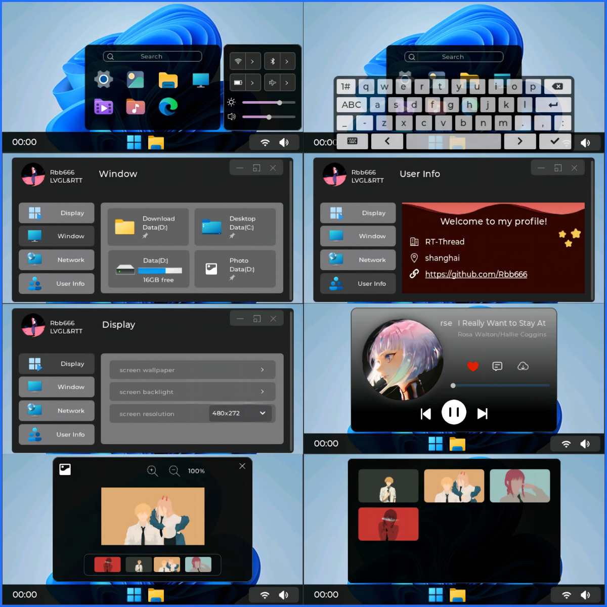
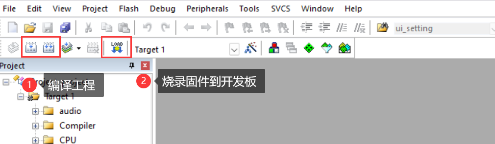
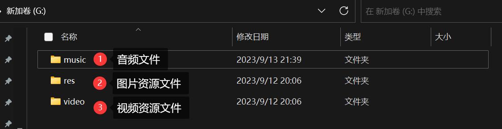
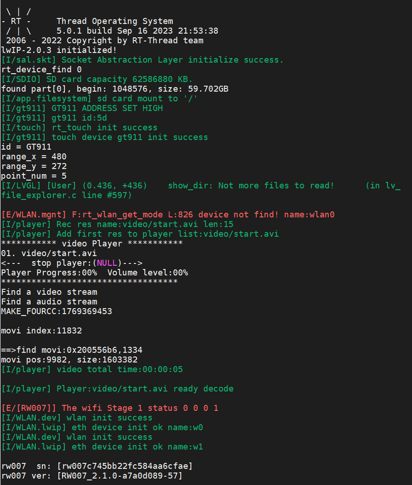

# Windows32
>  Windows32 是基于 LVGL8.3.8 开发的类windowsUI界面，具备丰富的UI动效和功能
>
> 本项目仅供个人使用，非商业用途

## 界面展示

## 支持平台

* Renesas-RA6M3

## 文件结构

* fimeware：固件源码
  * hmi-board-win32：适配 hmi-board 开发板的工程
  * ......
* ui-resources：需存放到SD卡等存储介质的资源
  * 注意：video下的资源由于太大，需要的可以自行制作：[视频资源制作方法](https://github.com/RT-Thread-Studio/sdk-bsp-ra6m3-hmi-board/blob/main/projects/hmi-board-video/README_ZH.md)

## 支持功能

1. 开机动画

2. 开始菜单

3. 设置菜单

4. 网络管理

5. 用户界面

6. 菜单缩放

7. 图片管理

8. 文件管理

9. 音乐播放

10. 视频播放

11. 媒体控制

12. 系统时间

## 使用说明

### Renesas-RA6M3 平台使用说明

> 工程基于 RT-Thread 5.0.1 版本开发，工具链：armclang，IDE：MDK5

进入到 `fimeware\hmi-board-win32` 目录下，双击打开 `project.uvprojx` 文件，然后按照下图所示进行编译烧录固件：

准备一张SD卡，用于存放资源文件（SD卡格式化可详见[这里](https://github.com/RT-Thread-Studio/sdk-bsp-ra6m3-hmi-board/blob/main/projects/hmi-board-video/README_ZH.md)）。SD卡的目录结构如下：

以下是开发板上电后打印的 LOG 信息：

